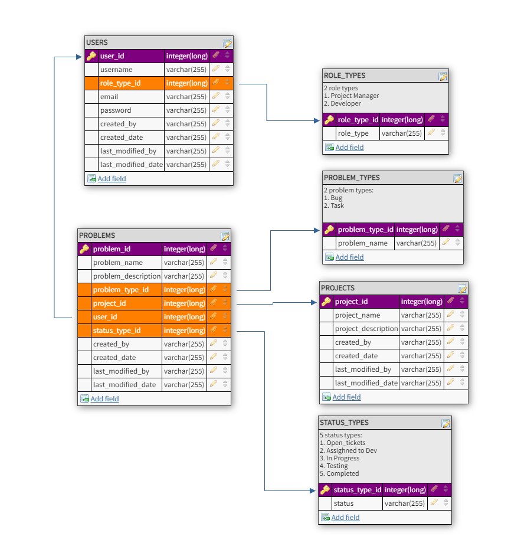

# Backend-Project-Managment-System

## Introduction

This is a basic database scheme with users, problems(tickets), projects, role_types, problem_types, and status types. 
This Java Spring REST API application willprovide the data modeling to support the project management system 8-up.

### Database layout

The table layouts are as follows:

* USERS
    * USER_ID Primary key, not null Long
    * USERNAME String
    * ROLE_TYPE_ID Long foreign key (one role_type to many users)
    * EMAIL String
    * PASSWORD String
    * CREATED_BY String
    * CREATED_DATE Timestamp
    * LAST_MODIFIED_BY String
    * LAST_MODIFIED_DATE Timestamp

* PROBLEMS
    * PROBLEM_ID primary key, not null Long
    * PROBLEM_NAME String, not null
    * PROBLEM_DESCRIPTION String
    * PROBLEM_TYPE_ID Long foreign key (one problem_type to many problems)
    * PROJECT_ID Long foreign key (one project to many problems)
    * PROJECT_MANAGER_ID Long foreign key (one project_manager to many problems)
    * DEVELOPER_ID Long foreign key (one developer to many problems)
    * STATUS_TYPE_ID Long foreign key (one status_type to many problems)
    * CREATED_BY String
    * CREATED_DATE Timestamp
    * LAST_MODIFIED_BY String
    * LAST_MODIFIED_DATE Timestamp

* PROJECTS
    * PROJECT_ID primary key, not null Long 
    * PROJECT_NAME double
    * PROJECT_DESCRIPTION double
    * CREATED_BY String
    * CREATED_DATE Timestamp
    * LAST_MODIFIED_BY String
    * LAST_MODIFIED_DATE Timestamp

* ROLE_TYPES
    * ROLE_TYPE_ID primary key, not null Long 
    * ROLE_TYPE String (either developer or project manager)

* PROBLEM_TYPES
    * PROBLEM_TYPE_ID primary key, not null Long 
    * PROBLEM_TYPE String (either bug or task)

* STATUS_TYPES
    * STATUS_TYPE_ID primary key, not null Long 
    * STATUS_TYPE String (1.Open ticket 2.Assigned to dev 3.In progres 4.Testing 5.Complete)

* Users has a foreign key to Role_Types this means:
    * Users has a Many to One relationship to Role_Types and
    * Role_Types has a One to Many relationship to Users

* Problems has a foreign key to Problem_Types this means:
    * Problems has a Many to One relationship to Problem_Types and
    * Problem_Types has a One to Many relationship to Problems

* Problems has a foreign key to Project_Id this means:
    * Problems has a Many to One relationship to Project_Id and
    * Project_Id has a One to Many relationship to Problems 

* Problems has a foreign key to Project_Manager_Id this means:
    * Problems has a Many to One relationship to Project_Manager_Id and
    * Project_Manager_Id has a One to Many relationship to Problems 

* Problems has a foreign key to Developer_Id this means:
    * Problems has a Many to One relationship to Developer_Id and
    * Developer_Id has a One to Many relationship to Problems 

* Problems has a foreign key to Status_Type_Id this means:
    * Problems has a Many to One relationship to Status_Type_Id and
    * Status_Type_Id has a One to Many relationship to Problems 